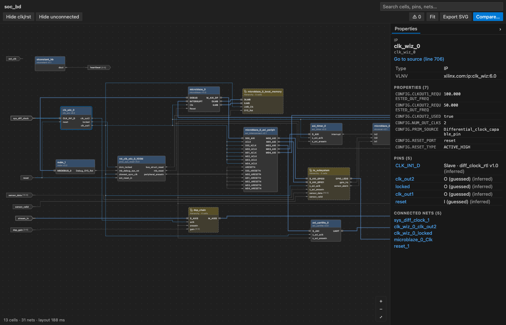
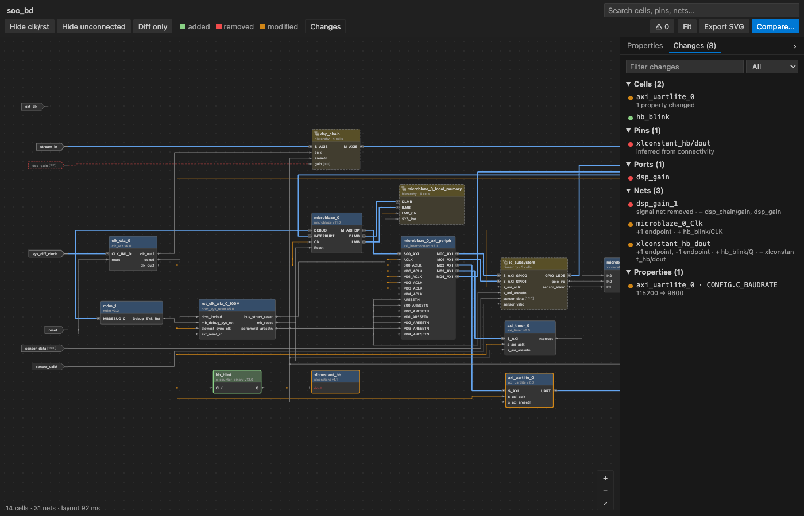
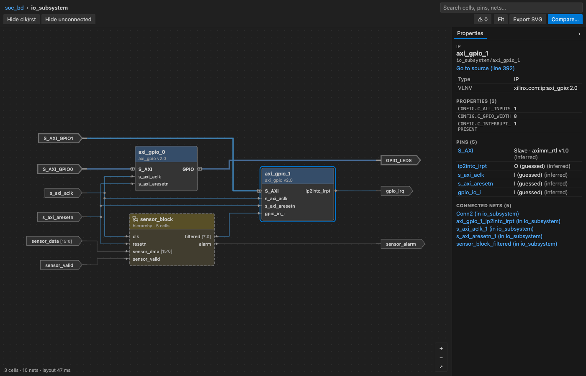

# Odin – FPGA Block Design Visualizer

Odin renders FPGA block designs as an interactive schematic inside VS Code and
Cursor, and shows what changed between any two git revisions directly on the
diagram.

Today Odin reads the Tcl scripts that Vivado produces with `write_bd_tcl`
(the usual way block designs are checked into version control). The
architecture is built around a tool-independent design model so that further
sources (Vivado `.bd` JSON, XDC constraints, HDL hierarchies) can be added as
adapters. See [docs/ROADMAP.md](docs/ROADMAP.md).



## Features

* **Vivado-style schematic** of an exported block design: IP, RTL module
  references and hierarchical cells with their pins, interface pins and nets.
* **Drill-in navigation**: double-click a hierarchical cell to enter it, use
  the breadcrumb or Backspace to go back up.
* **Click to source**: any cell, pin, net or diagnostic jumps to the Tcl line
  that created it.
* **Search** across cell, pin and net names in the whole design.
* **Noise filters**: hide clock/reset nets and unconnected pins.
* **Properties panel** with CONFIG values, pins, connected nets and location.
* **Compare with git**: pick HEAD, a previous commit, a branch, a tag or any
  revision. Added, removed and modified cells, pins, nets and properties are
  colored in place, removed objects are ghosted, and a Changes panel lists
  everything with before/after values.
* **Auto refresh on save**, including recomputing an active comparison.
* **Export as SVG** for documentation and pull requests.



## Installation

Odin ships as a `.vsix` on the
[GitHub Releases](https://github.com/bardiabarabadi/odin/releases) page.

1. Download the latest `odin-<version>.vsix`.
2. In VS Code or Cursor open the Command Palette and run
   **Extensions: Install from VSIX…**, then pick the file.

Or from a terminal:

```bash
code --install-extension odin-<version>.vsix     # VS Code
cursor --install-extension odin-<version>.vsix   # Cursor
```

Comparison needs `git` on your `PATH` (or set `odin.git.path`). Works on
macOS, Windows and Linux.

## Usage

1. Open a block-design Tcl export, for example `bd/top.tcl`.
2. Run **Odin: Visualize Block Design** (`Ctrl+Alt+O`, `Cmd+Alt+O` on macOS),
   click the schematic icon in the editor title, or right-click the file and
   choose the same command. You can also use **Open With… › Odin Block
   Design** to open the file directly as a diagram.
3. Navigate: double-click to enter hierarchies, drag to pan, wheel to zoom,
   `0` to fit. Click to select, `Ctrl`/`Cmd`+click to jump to the source line.
4. Compare: run **Odin: Compare Block Design With Git Revision…** from the
   panel toolbar or the command palette and choose a base revision.
   **Odin: Clear Comparison** removes the overlay.
5. Export: **Odin: Export Diagram as SVG**.



### Commands

| Command | Description |
| --- | --- |
| `Odin: Visualize Block Design` | Open the diagram beside the source |
| `Odin: Compare Block Design With Git Revision…` | Overlay a diff against a chosen revision |
| `Odin: Clear Comparison` | Remove the overlay |
| `Odin: Refresh Diagram` | Re-parse the source now |
| `Odin: Export Diagram as SVG` | Save the current scope as a self-contained SVG |
| `Odin: Open Source File` | Open the Tcl file that the panel shows |
| `Odin: Show Log` | Open the Odin output channel |

### Settings

| Setting | Default | Description |
| --- | --- | --- |
| `odin.autoRefreshOnSave` | `true` | Re-parse and redraw when the source is saved |
| `odin.hideClockResetNetsByDefault` | `false` | Start with clock/reset nets hidden |
| `odin.hideUnconnectedPinsByDefault` | `false` | Start with unconnected pins hidden |
| `odin.compare.defaultRef` | `"HEAD"` | Revision offered first in the compare picker |
| `odin.git.path` | `"git"` | Git executable used for comparisons |

## How it works

```
 .tcl  ──►  adapter (Tcl interpreter)  ──►  Design model  ──►  ELK layout + SVG (webview)
                                                  │
 git show <ref>:file  ──►  adapter  ──►  Design ──┴──►  semantic diff  ──►  overlay + change list
```

The Tcl adapter executes the exported script with a small built-in Tcl
interpreter against a virtual block design, so procedures, variables and
`catch`/`if` constructs are handled the same way Vivado handles them. The
result is a tool-independent model that the renderer and the diff engine
consume. Details in [docs/ARCHITECTURE.md](docs/ARCHITECTURE.md).

## Limitations

* Exported scripts do not declare the pins of packaged IP. Odin reconstructs
  them from connections and guesses directions from names; unknown pins are
  placed on the left and marked as guessed in the properties panel.
* Layout is automatic and recomputed per hierarchy level; manual placement is
  not stored yet.
* Only the current hierarchy level is exported to SVG.

## Contributing

Bug reports and pull requests are welcome. Start with
[CONTRIBUTING.md](CONTRIBUTING.md) and [AGENTS.md](AGENTS.md) (a short
orientation for new contributors and automated coding assistants), then the
per-folder READMEs. All test fixtures are synthetic; please do not submit real
project files.

## License

[MIT](LICENSE)
